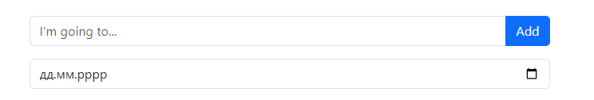
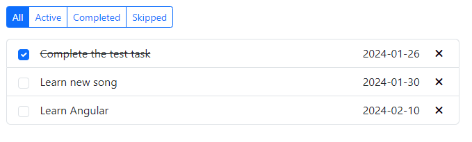

#  Task tracker

## Overview

Easily manage your tasks and set deadlines. Stay organized, boost efficiency, and accomplish your goals seamlessly.

## Actions

### First, you need to create a task and add a due date for it:


### Filter your tasks by these criteria:


### To update a task - simply double-click on it.

## Technologies

* **HTML**.
* **CSS**.
* **React**.
* **JavaScript**.
* **[REST API](https://github.com/typicode/json-server)**.

## Setup

1. Download or clone repository `git clone https://github.com/dolphinnq/Task-tracker.git`.
2. Open the project folder with the code editor (VS Code, WebStorm, other).
3. Run ```npm install``` in terminal.
4. Install JSON server ```npm install json-server```.
5. Start JSON server ```npx json-server src/db.json```.
6. Open the second terminal and run ```npm run dev```.
7. If the tab does not open, go to ```http://localhost:5173``` in your browser.
